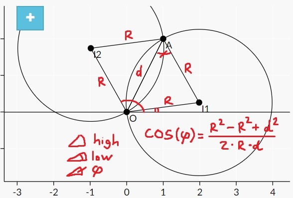
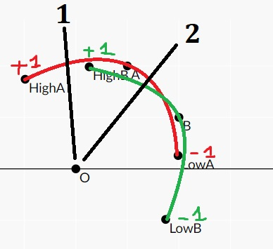

# 2018 ICPC South Central USA Regional Contest
## Tổng quan
|[A](#a)|[B](#b)|[C](#c)|[D](#d)|[E](#e)|[F](#f)|[G](#g)|[H](#h)|[I](#i)|[J](#j)|[K](#k)|[L](#l)|
|-------|-------|-------|-------|-------|-------|-------|-------|-------|-------|-------|-------|
|  SOL  |  SOL  |  SWH  |  N/A  |  SOL  |  SOL  |  SOL  |  UPS  |  SOL  |  N/A  |  SOL  |  N/A  |

Ký hiệu: 
1. `N/A`: Not attempted
2. `SOL`: Solved within the contest time
3. `SWH`: Solved with hint (from tutorial, solutions,... or from any external material), in the contest time
4. `UPS`: Upsolved - solved after the contest
5. `NAC`: Not accepted - failed during contest, not yet upsolved

## Cụ thể
### A
[Link to submission](A/data.cpp)

### B
[Link to submission](B/data.cpp)

Mình nhận thấy đây là bài test khả năng triển khai code.

Khó khăn duy nhất là tính cân bật x của một số. Có thể tính cân bật `5` của `2` bằng hàm `pow(2, 1.0/5)` vì mũ 1/x chính là cân bật x. Sau đó, hãy cố gắng kiểm tra sai số và đọc thật kỹ và làm đúng yêu cầu của đề.

### C
[Link to submission](C/data.cpp)

Bài này nhóm mình giải sau khi đã xem slide của judge. Solution được code trâu bò hơn mô tả trong slide. Solution của nhóm Duyệt qua tất cả substring của `B`, tỉnh mảng `cnt` từng ký tự (histogram) và lưu mảng đó vào một set. Sau đó, duyệt qua tất cả substring của `A`, tìm histogram và check set có chứa histogram hay không.

Độ phức tạp `O(n * n * log(n*n) * 26)`.
Có vẻ sử dụng set có độ phức tạp tệ nhất tệ hơn unordered_set nhưng thời gian trung bình và hằng số nhỏ hơn, nên solution của nhóm sử dụng set đã pass, còn unordered_set bị TLE. Hoặc có lẽ hàm Hash của nhóm không tối ưu.

Solution của judge chỉ duyệt độ dài K và tìm thử có tồn tại histogram độ dài K của A và B hay không, khiến solution chạy nhanh hơn với `O(n*n)` vì chi có tối đa `n` histogram, trái lại với `n*n` chuỗi con.

### D
[Link to submission](D/data.cpp)

### E
[Link to submission](E/data.cpp)

### F
[Link to submission](F/data.cpp)

### G
[Link to submission](G/data.cpp)

### H
[Link to submission](H/data.cpp)

- Chặt nhị phân bán kính R
- Xét điểm P, với bán kính R, đường tròn có thể quay quanh (0, 0) tối đa là hai góc (low, high) mà điểm P sẽ nằm trên đường tròn này. Tối thiểu là khi P và (0, 0) tạo thành đường kính.
- Nhiệm vụ là phải tính hai góc (low, high) này. Hai góc này tạo thành một đường cung, mà nếu tia (0,0)->(Tâm đường tròn) ở trong đường cung này thì chắc chắn điểm P sẽ nằm trong đường tròn.
- Tính như sau:

  
Image

  

- Với mỗi điểm P, ta tính được góc (low, high) và sẽ chuyển bài toán này thành: Có tồn tại một góc Phi nào đó mà cắt qua từ K trở lên đường cung này không?

  
Image

  

- Sử dụng angle sweep để giải. Cẩn thận với những đường cung có đầu lớn hơn PI hay nhỏ hơn -PI vì chúng sẽ phải vòng lại hình tròn.

### I
[Link to submission](I/data.cpp)

### J
[Link to submission](J/data.cpp)

### K
[Link to submission](K/data.cpp)

### L
[Link to submission](L/data.cpp)

